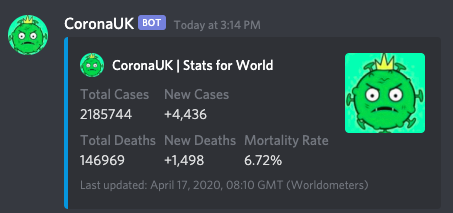

# CoronaBotUK
A simple Discord bot that shows Corona statistics 

Example :

Bot prefix !

Bot Commands

!help                         Shows avalible commands
!uk_stats                     Corona stats for the UK
!stats <country>              Corona stats for the named country
